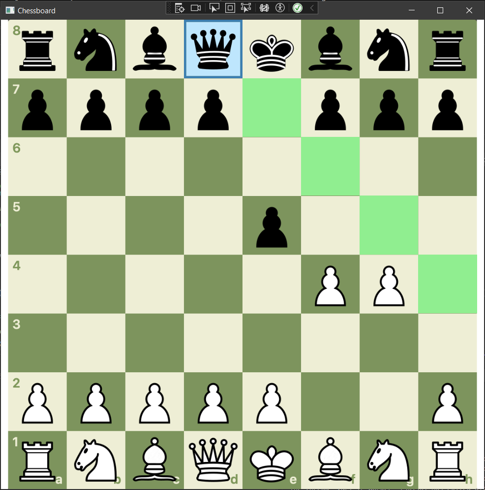
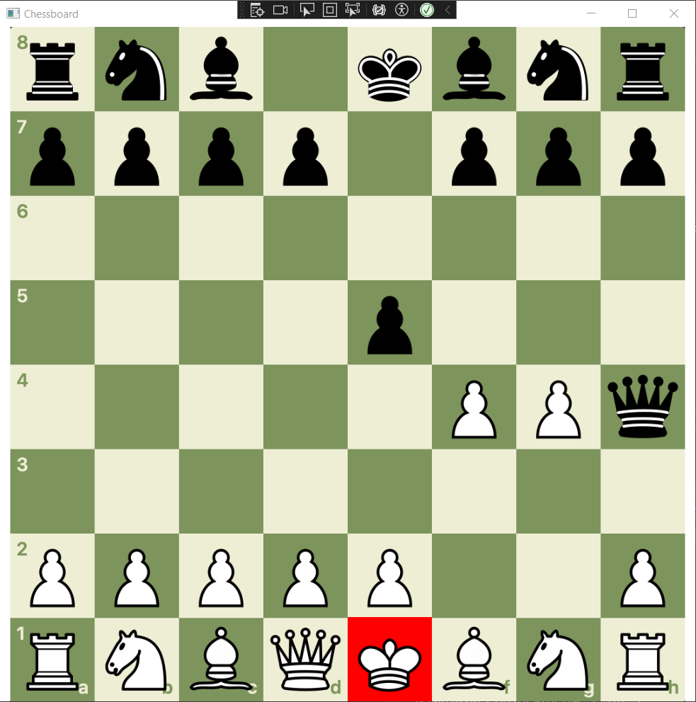

# Chess Game
This is a graphical chess game implemented in C# using WPF. It simulates a two-player chess match, providing functionality to move pieces, detect valid moves, and handle special rules such as check, checkmate, and pawn promotion. The game includes visual and auditory feedback, custom cursors, and dynamic highlights to indicate available moves, check status, and the current player's turn. The player may also play against the computer.

  
  

## Features

- **Single-Player Mode:** User plays against a computer-controlled player.
- **Two-Player Mode:** Players alternate turns to make moves, one playing white and the other black.
- **Piece Movement:** All chess pieces (Pawn, Bishop, Knight, Rook, Queen, King) have their own specific movement rules.
- **Check and Checkmate Detection:** The game automatically checks if a king is in check or checkmate after each move.
- **Pawn Promotion:** Pawns that reach the end of the board are automatically promoted to a Queen.
- **Game Over Detection:** The game ends when one player checkmates the other.
- **Custom Cursors:** The game changes the cursor depending on which player's turn it is (White or Black), providing a clear visual indication of whose turn it is.
- **Sound Effects:** Sound effects play when pieces are moved, when a check happens, and when the game ends.
- **Visual Check Indicators:** When a king is in check, the board visually highlights the king's square to indicate the check status.
- **Move Highlighting:** Valid moves for a selected piece are highlighted on the board. This includes highlighting enemy pieces in red and valid empty squares in green.
- **Chessboard Graphics:** The chessboard and pieces are visually represented using images for a better user experience.

## Note about assets:
- Assets are NOT included due to copyright. 
- Put sound assets you wish to use in /GameUI/Assets/Sound. They should be named check.wav, move.wav & gameover.wav.
- Put cursors for each player in /GameUI/Assets/Cursor. They should be named cursor1.cur & cursor2b.cur.

## Game Rules Implemented

### Piece Movement

Each type of chess piece moves differently:

- **Pawns** move forward one square, but on their first move, they can move two squares. They capture diagonally.
- **Knights** move in an "L" shape (two squares in one direction, then one square perpendicular to that). They are the only pieces that can jump over other pieces.
- **Bishops** move diagonally any number of squares, but cannot jump over other pieces.
- **Rooks** move horizontally or vertically any number of squares.
- **Queens** combine the movement abilities of both the Rook and the Bishop, moving any number of squares horizontally, vertically, or diagonally.
- **Kings** move one square in any direction and are the most important piece in the game. If a King is in check and cannot escape, the game is over.

### Special Rules

- **Check:** When a king is under threat of being captured, it is said to be in check. The player must move the king out of check, block the check, or capture the attacking piece.
- **Checkmate:** The game ends when a king is in check and there are no legal moves to escape the check.
- **Pawn Promotion:** A pawn that reaches the last rank is automatically promoted to a Queen.

## Setup and Installation

1. Clone or download the repository.
2. Open the project in Visual Studio or your preferred C# IDE.
3. Build the project and run the application to start the game.

## How to Play

1. **Start the Game:**
   - The game begins with White playing first.
   - Each player selects a piece and moves it according to its rules.

2. **Making a Move:**
   - Players take turns selecting a piece and moving it on the chessboard.
   - To move a piece, select the piece, then select its target square.
   - If the move is valid, the piece will be moved, and the board will be updated.

3. **Game Over:**
   - The game ends when a player's king is checkmated.

4. **Special Moves:**
   - Pawns that reach the opposite back rank will be automatically promoted to a Queen.
   - If a king is in check, the player must move the king or block the check.

## Visual and Auditory Feedback

- **Custom Cursors:** The game uses custom cursors to indicate which player's turn it is. The cursor changes when switching between the White and Black player turns.
- **Sound Effects:** Various sounds are triggered during the game to enhance the user experience:
  - A sound plays when a piece is moved.
  - A sound plays when a capture happens.
  - A sound plays when the game ends (checkmate or game over).
- **Move Highlighting:** When a piece is selected, its valid moves are visually highlighted in green for empty squares and red for enemy pieces.
- **Check Indication:** When a king is in check, the board visually highlights the king's square with a blinking effect to indicate the check status.

## Directory Structure

- **GameLogic/**: Contains the core game logic, including classes such as `Board`, `Piece`, and the individual piece types (e.g., `Pawn`, `Rook`, `King`).
- **GameUI/Assets/**: Stores the assets used in the game, including images, custom cursors and sound effects.
- **GameUI/UIClasses/**: Contains helper classes for managing the user interface, including handling visual updates and interactions.
- **GameUI/MainWindow.xaml.cs**: The main file that serves as the entry point for the application, handling the UI and game logic integration.

## Technologies Used

- C# (Object-Oriented Programming)
- .NET Framework
- WPF application
- Visual Studio
